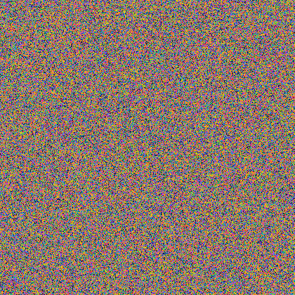

# π Explorer

A spelunking kit for the digits of π.

It computes π to a ridiculous number of digits using the Chudnovsky algorithm
spread across every core you have, memory-maps the result so searching stays
instant at billion-digit scale, and then lets you go looking for things:
your birthday, your phone number, words, pictures — and hard evidence about
whether π is actually random.

**Pure standard library. No dependencies. One `git clone` and it runs.**

```bash
python pi.py compute --auto     # size the run to this machine and go
python pi.py                    # interactive shell
```

---

## What it does

### Search

Type a number. Find out where it lives, how many times, and whether that is
normal.

```
$ python pi.py find 123456

  123456   6 digits
  ----------------------------------------------------------------------
  first appearance         not in the first 2,000,000 digits
  expected                 2.00 occurrences (1 in 1,000,000)
  odds of that             13.5% -- missing is normal here
  even-odds depth          693,000 digits -- you are already 2.9x past that
  This one is simply running late. Pi does not owe you a schedule.
```

```
$ python pi.py find 12345

  12345   5 digits
  ----------------------------------------------------------------------
  first appearance         position 49,702
  occurrences              17 in 2,000,000 digits
  expected                 20.00 (1 in 100,000 per position)
  luck                     turned up 2.0x sooner than expected
  count sanity             looks random (p=0.5941)
  in context               ...7731177648973523092666[12345]8887310288351562644602...
```

Every count is an **overlapping** count and is verified against brute force in
the test suite. `--all` lists individual positions.

### The odds

`pi odds` answers the question the search keeps raising: what is actually
findable in the digits you have?

```
  digits             odds per spot  expected hits  will it appear?  even-odds depth
       4               1 in 10,000         200.00          certain    6.93 thousand
       6            1 in 1,000,000           2.00           86.47%     693 thousand
       8          1 in 100,000,000           0.02            1.98%      69.3 million
      10       1 in 10,000,000,000           0.00            0.02%      6.93 billion
      16  1 in 10,000,000,000,000,000        0.00         2e-08%    6.93 quadrillion
```

So: every 4-digit PIN is already in your first two million digits. Every
birthday needs about 69 million for even odds, and is a near certainty by 1.5
billion. A 16-digit card number needs 6.93 quadrillion, and nobody has ever
computed that far.

### Is π actually random?

This is the interesting part. `pi random` runs the standard battery of
randomness tests — and runs the **same battery on a real cryptographic random
stream**, side by side, so you can see whether π looks any stranger than
actual randomness.

```
  test                   statistic                                     verdict
  digit frequency        chi2=5.51 df=9                                looks random (p=0.7879)
  2-digit blocks         chi2=94 df=99                                 looks random (p=0.6169)
  3-digit blocks         chi2=958 df=999                               looks random (p=0.8190)
  4-digit blocks         chi2=9,978 df=9,999                           looks random (p=0.5561)
  6-block coverage       631,548 of 1,000,000 seen (expected 632,119)  looks random (p=0.2365)
  poker hands (200,000)  chi2=4.61 df=4                                looks random (p=0.3299)
  gaps between repeats   chi2=50.62 df=40                              looks random (p=0.1212)
  serial correlation     r=-0.001391 z=-1.39                           looks random (p=0.1643)
  high/low runs          501,137 runs, z=+2.27                         eyebrow raised (p=0.0231)
  random walk drift      drift=-66 z=-0.02                             looks random (p=0.9817)
  compressibility        3.7636 bits/digit                             informational

-- control group -- same tests, known random sources ---------------------------

  test                   the digits of pi  Mersenne Twister  the OS cryptographic RNG
  digit frequency                  0.7879            0.7490                    0.9022
  serial correlation               0.1643            0.3376                    0.0038
  high/low runs                    0.0231            0.2271                    0.0012
```

Look at that last column. On this particular run π passed all ten tests while
the operating system's cryptographic random number generator "failed" two of
them at p&nbsp;<&nbsp;0.01. That is not a bug in your OS — it is what running
eleven tests looks like. It is also the single best argument for why the
control group is in here: without it, one low p-value on π looks like a
discovery instead of a Tuesday.

Nobody has ever proved π is normal. Nobody has ever found where it breaks.

Tests included: digit frequency and entropy, χ² on 2- through 6-digit blocks,
coupon-collector block coverage, the poker-hand test, the gap test,
lag-1 serial correlation, the Wald–Wolfowitz runs test, random-walk drift, and
a compression floor check. `--deep` widens the block tests, `--matrix` draws
the 10×10 heatmap of which digit follows which.

### Words

Read π two digits at a time and every pair becomes a letter. π stops being a
number and becomes a 500,000-page book of gibberish that happens to contain
every word you will ever write.

```
$ python pi.py text cat dog math space

  cat    first appearance   letter 22,731 (digit 45,461)
  dog    first appearance   letter 44,145 (digit 88,289)
  math   first appearance   letter 91,682 (digit 183,363)
  space  not in the first 1,000,000 letters
         expected at        letter 11,881,376 = 23,762,752 digits deep
```

One extra letter multiplies the search depth by 26. `space` needs about 24
million digits. Modes: `pairs` (default, dense), `a1z26` (a=01…z=26, searched
as a raw digit run), `ascii` (3-digit codes).

### Pictures

Give every digit a colour, lay them out in rows, and π becomes an image.



```bash
python pi.py wall --out pi.png --cols 1000 --rows 1000    # 1M digits, 1 px each
python pi.py wall --palette fire --bits half              # black and white
python pi.py wall                                          # right in the terminal
```

It looks like television static, because as far as anyone can tell, it is.

### Shapes

Collapse π to one bit per digit (0–4 dark, 5–9 light) and every pixel becomes
a coin flip instead of a ten-sided die. Now shapes become findable — and
because the same digit stream reflowed into a different row width is a
completely different picture, scanning every width from 5 to 128 multiplies
your chances by 124.

```
$ python pi.py shape pi

    █████
    ·█·█·
    ·█·█·
    ·█·█·

  grid                     5 x 4 = 20 pixels
  odds per spot            1 in 1,048,576
  row widths tried         124 (5-128)
  scanning on 15 cores... 386ms

  FOUND at digit 1,543 when pi is laid out 73 pixels wide
```

The symbol we invented for π, drawn in π's own digits, 1,543 digits in.

`pi shapes` lists the built-ins (square3…square5, box, x, plus, checker,
heart, smiley, pi, arrow, diamond, amongus) or draw your own:
`pi shape '.##./####/#..#'`.

Be honest with yourself about the odds: an n-pixel shape is 1 in 2ⁿ per spot.
A 6×6 grid is 36 pixels — 1 in 68 billion — and no amount of clever row-width
scanning rescues that from two million digits. The tool always prints the
expected number of finds before it starts.

### Pattern hunt

```
$ python pi.py hunt

  The Feynman Point
  position 762             999999  six 9s in a row

  Longest repeats          7x3  3333333  at 710,100
                           7x9  9999999  at 1,722,776
  Longest palindrome       9475082805749 at 879,326
  Self-locating strings    '1' at 1, '16470' at 16,470, '44899' at 44,899
  Staircases               23456789 at 995,998
  Digit deserts            156 digits with no '4' from 236,102
  The hold-outs            '33394' hides until position 1,369,560
```

Longest palindrome uses Manacher's algorithm, so it is O(n) — a million digits
in under a second.

### Also in the box

- `pi walk 200000` — π as a random walk, drawn in braille, or `--svg` for print
- `pi rain` — Matrix rain where the glyphs are the actual digits in order
- `pi quiz` — how many digits can you type before you break?
- `pi decode 45461 80` — read π as letters from any position
- `pi dump 1 500` — raw digits
- `pi bench` — time your machine's digit factory
- `pi import digits.txt` — load someone else's billion-digit file

---

## Speed and scale

The engine is Chudnovsky by binary splitting. Every intermediate stays an
exact integer, so the whole series collapses into one big rational and the
only expensive steps are a handful of enormous multiplications, one square
root, and one division.

**It uses your machine.** Term blocks are split across every core but one and
merged in a parallel tree; the square root of 10005 runs on its own core
concurrently with the series, because it does not depend on it. The digit
ceiling comes from your actual free RAM, and `--auto` picks the biggest round
number it can finish inside 30 seconds.

On a 16-thread desktop:

| digits | time | notes |
| --- | --- | --- |
| 100,000 | 0.2s | |
| 1,000,000 | 5.1s | 7.1s single-threaded |
| 2,000,000 | 15.2s | |
| 5,000,000 | ~50s | |

```
$ python pi.py compute 2000000
  141,030 Chudnovsky terms  |  15 workers  |  ~0.08 GB peak RAM
  splitting across 15 cores         2.76s
  collecting sqrt(10005)            1.88s
  final merge                       3.93s
  one enormous division             6.05s
  rendering to decimal              600ms
  2,000,000 digits in 15.25s (131,126 digits/sec)
```

Searching does not care how big the file gets. Digits are stored once in
`~/.pi_explorer/pi.dat` and opened with `mmap`, so the OS pages in only the
bytes a search actually touches — a multi-gigabyte digit file opens instantly
and `find` still runs at C speed over all of it.

Counting is exact, not sampled. Needles that cannot overlap themselves are
counted with C-speed block scans; self-overlapping ones (`11`, `123123`) fall
back to a position walk so the count stays correct.

Every computation is checked against the known first 100 digits of π before
it is written to disk. If that check fails, nothing is stored.

---

## Commands

```
pi compute [N] [--auto] [--patience S] [--force]   compute and store digits
pi info                                            what is in the vault
pi bench [sizes...]                                time the digit factory
pi import FILE                                     load an external digit file

pi find NEEDLE... [--all] [-d N]                   search, count, odds
pi birthday DATE [-d N]                            a date in every format
pi text WORDS... [-m pairs|a1z26|ascii]            words hidden in the digits
pi decode POS [COUNT]                              read pi as letters
pi dump POS [COUNT] [--width W]                    raw digits
pi odds [-d N]                                     the probability tables

pi random [--deep] [--vs mt os] [--matrix]         the randomness battery
pi hunt [-d N]                                     Feynman point, palindromes

pi wall [--out F] [--cols C] [--rows R] [--scale S] [--palette P] [--bits R]
pi shape SPEC [--bits half|parity] [--max-width W]
pi shapes                                          the shape library
pi walk [STEPS] [--svg F] [--height H]
pi rain [--seconds S]
pi quiz [--study N]

pi shell                                           interactive (also the default)
```

Global: `-w/--workers N`, `--no-color`.

In the shell, typing a bare number searches for it.

---

## Requirements

Python 3.11 or newer. Nothing else.

Digits are cached in `~/.pi_explorer/` (override with `PI_EXPLORER_HOME`).

## Licence

MIT.
